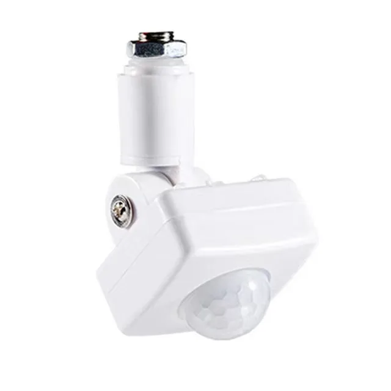
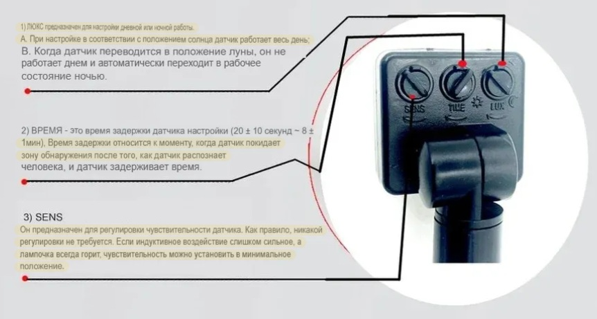
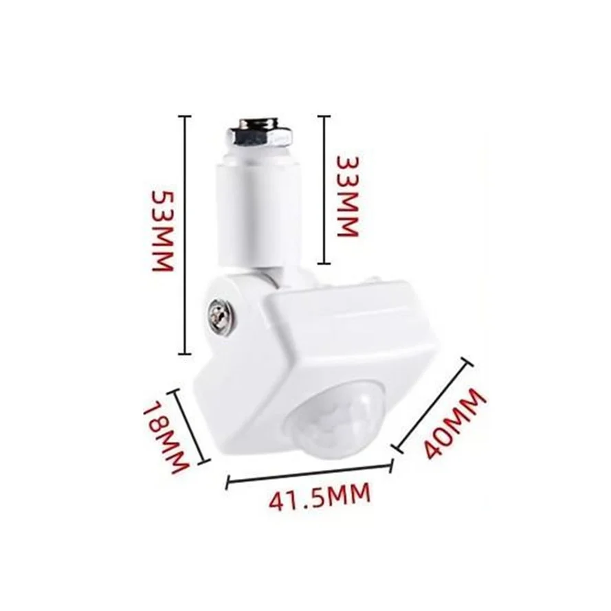
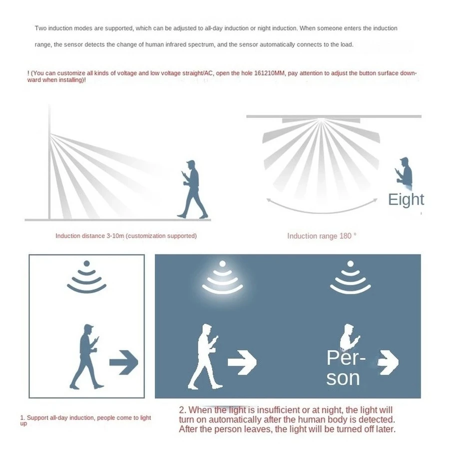

## [Ультратонкий водонепроницаемый датчик движения PIR](https://aliexpress.ru/item/1005004601316944.html?spm=a2g2w.orderdetail.0.0.26014aa6CDZOGJ&sku_id=12000029787885240&_ga=2.143138677.1156965911.1751905425-257156806.1703682747)

***Описание:***

Открытая версия интерфейса диаметром 10 мм изготовлена из железа.

Регулируемое расстояние срабатывания / интенсивность света / время включения.

Небольшой размер и высокая чувствительность.

Диапазон контроля 160 градусов.

1) Переключатель LUX предназначен для настройки режима работы днем или ночью.

A. При настройке на положение солнца датчик работает весь день;

B. При установке на положение Луны датчик не работает днем и автоматически переходит в рабочее состояние ночью.

2) Переключатель ВРЕМЕНИ предназначен для регулировки времени задержки датчика (20±10 с ~ 8 +1 мин)

Время задержки - это время, когда датчик покидает зону обнаружения после того, как он обнаружит человека, и датчик задерживает время.

3) Переключатель SENS - это чувствительность датчика регулировки. Как правило, регулировка не требуется.

Если индуктивное воздействие слишком сильное и свет постоянно включен, чувствительность можно установить в минимальное положение.

Перспектива Френеля, эффективное преломление.

Корпус из огнестойкого материала, ударопрочный.

***Спецификация:***

Дальность обнаружения: 160 градусов.

Расстояние обнаружения: 6-8 м (при 25 градусах Цельсия).

Окружающее освещение: 2-2000 люкс (регулируется).

Рабочая влажность: менее 93% относительной влажности воздуха.

Материал: ABS.

Способ установки: открытый (отверстие 10 мм/12 мм).

Рабочее напряжение: 85-265 В переменного тока.

Время задержки: 8 секунд - 6 минут (регулируется).

Рабочая температура: -10 градусов по Цельсию - 40 градусов по Цельсию.

Высота установки: 1,8 м-2,5 м.

Размеры: 42 * 40 * 20 мм.

### [Инфракрасный датчик движения HC-SR501](https://robotchip.ru/obzor-infrakrasnogo-datchika-dvizheniya-hc-sr501/)
