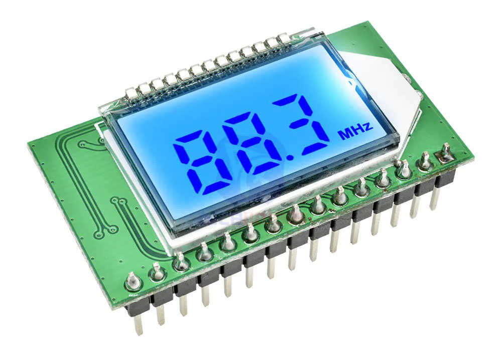
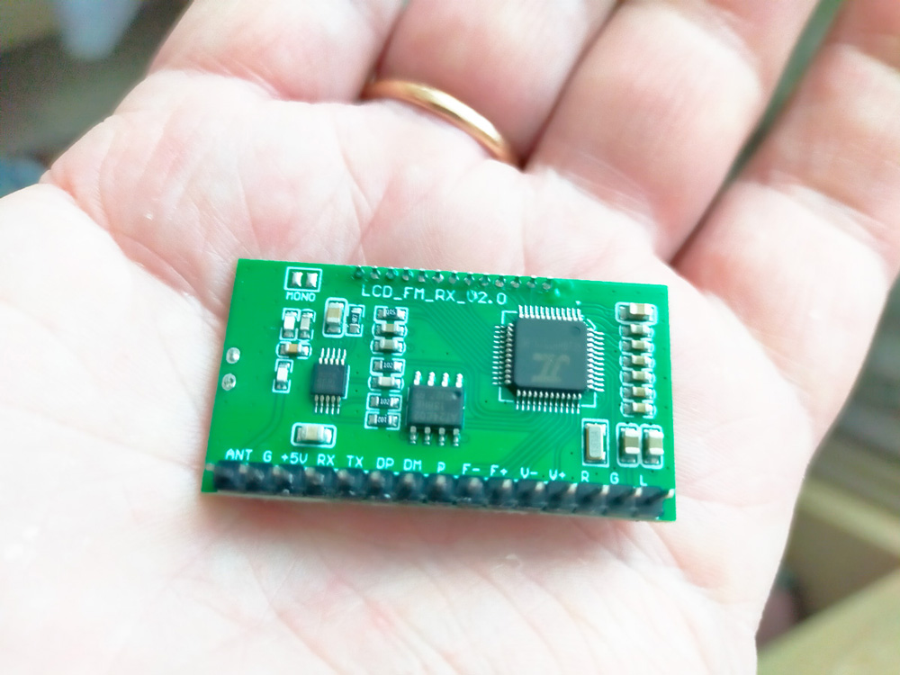
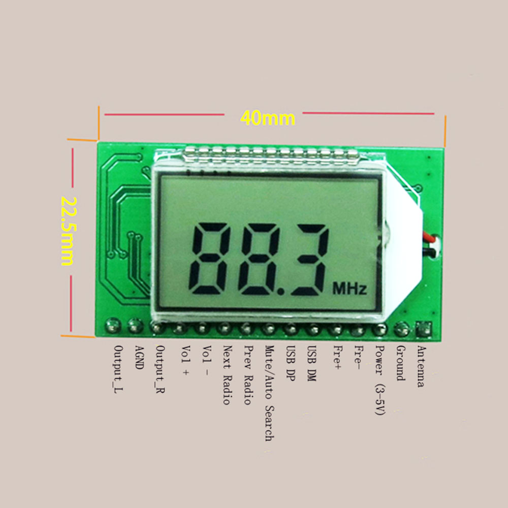

### [Модуль FM радиоприемника DSP PLL 87-108 МГц](https://dzen.ru/a/ZDef2RUfcHalN5CO)







Открытия:

1. На Arduino Uno 0 и 1 цифровые входы\выходы (пины) заняты для обмена по штатному последовательному порту и их при отладке (при постоянной перезаписи программ) не желательно использовать, мешают.

2. Скорость обмена командами с модулем радиоприемника задана однозначно и составляет 38400 Мбит/сек.

3. AT-команды отправляются в порт радиоприемника "как есть" - прописными (большими) буквами без пробелов (промежутков). 

```
1: Использование передовой технологии цифровой обработки аудиосигнала (DSP)
   и FM-модуляции с фазовой автоподстройкой (PLL) для придания звуку 
   большей реалистичности, более стабильных характеристик, длительного 
   времени работы без смещения частоты.
   
2: ЖК-дисплей более интуитивно понятен и точен, с очень низким
   энергопотреблением  и минимальными шумовыми помехами.
   
3: Благодаря автоматическому поиску радиостанции и функциям сохранения
   радиостанций, receiver module прост в управлении и использовании.
    
4: Встроенная цифровая регулировка громкости на 30 градусов позволяет 
   легко выполнять основные операции.
   
5: Автоматическое запоминание данных об отключении питания перед 
   сбоем питания.
   
6: Поддержка последовательных команд AT.

7: Стабилизация частоты кварцевого кристалла - изменение температуры больше 
   не приводит к смещению частоты.
   
8: Автоматический поиск в полном диапазоне и сохранение диапазона сигнала 
   в памяти.
 
 
Параметры продукта:
 
Выходная мощность:           500 МВт (проводные наушники)
Диапазон частот:             50 Гц-18 кГц
Канал:                       стерео
Диапазон регулировки частоты приема:
                             закрытое кампусное радио 87,0 МГц-108,0 МГц, 
                             открытое кампусное радио 76,0 МГц-108,0 МГц
Эквивалентный уровень шума:  ≥30 дБ
Напряжение питания:          3,0 В-5,0 В
Ток:                         40 мА
```


#### [Список AT-команд LCD FM RX v2.0](AT-comands_FM_module.html)


#### [Модуль FM радиоприемника DSP PLL 87-108 МГц](https://dzen.ru/a/ZDef2RUfcHalN5CO)

На порт ANT подключаем антенну. Можно провод 20 см, в городе ловит все радиостанции. К G и +5V питание. Лучше подключить 3.3 вольта. Пишут, что при 5 вольтах происходит выгорание чипа. К последним портам R G L – колонку. Порт RX подключаем к порту Arduino TX. Соответственно порт TX -> RX, перекрещиваем соединение.

```
#include <SoftwareSerial.h>      // подключили библиотеку
SoftwareSerial mySerial(2, 3);   // создали объект подключения

// Посылаем команды
mySerial.println("AT+PAUS");     // "поставить на паузу"
mySerial.println("AT+FRE=1035"); // "включить Европа Плюс на частоте 103.5МГц"
```

#### [Крошечная документация, найденная в интернете](kroshechnaya-dokumentaciya-najdennaya-v-internete/kroshechnaya-dokumentaciya-najdennaya-v-internete.md)

#### [FM-радио за 383 рубля, но не так просто!]()

> Увидел в продаже электронную плату стерео-FM-радио, смотрю - обойдётся мне за 383 рубля. Хорошо, пенсии хватит. 
> 
> Интересно то, что можно будет подавать команды с компьютера для управления звуком и радиостанциями.  На даче давно надо музыкальный фон создать. Решено,
> буду покупать. 
> 
> Купил, переделал наушник, чтобы можно было не к смартфону подключаться, а к этому новому радио (схему усилителя для колонок потом найду, сделаю, подключу к колонкам).
> 
> Навесил проводов, собрал на столе чудо века - новый радиоприемник. Подключился, ... что я слышу!
> 
> Ничего хорошего, только шум. Подаю команды, команды не понимает. Приехал!
> 
> Копаюсь в интернете, по моему случаю информации - практически ноль. Но, русские не сдаются.
> 
> Что же делать? Решил поставить себя на место этой железяки ("железячечка, прошу прощения"). Пробую смоделировать ситуацию на компьютере, представить ресивер, как чёрный ящик с такими же наружу проводами, добиться получения правильных ответов, а потом просто перебросить провода на приёмник.
> 
> В общем, смоделировал. Выявил пару новых моментов,  на компьютере получилось, переключился на железо. Подкорректировал. Не получается! 
> 
> Роюсь, роюсь в интернете дальше... И, наконец, нашел еще один нюанс. 
> 
> В общем, по ходу жизни сделал три открытия и, мой дорогой, ресивер LCD FM RX v2.0 заработал! Слушаем "Вести FM", "Радио 10" и, конечно, другие радиостанции. Благо, в Петрозаводске их много.
> 
> PS. Когда я учился в школе рационализаторов, мы изучали процедуру "синектики" - когда себя представляешь изучаемым объектом. Сильно увлекаться этим не нужно, чтобы не было последствий. Но, вот, сейчас пригодилось в жизни.

#### [Тестирование FM-радио LCD FM RX v2.0](testirovanie.md)

#### Библиография

#### [MP3510 - FM-тюнер с DSP и PLL](https://www.rlocman.ru/review/article.html?di=454049)

#### [Монитор порта, отладка](https://alexgyver.ru/lessons/serial/#отправка-и-парсинг)

#### [Отправка и парсинг Serial](https://alexgyver.ru/lessons/parsing/) 

#### [Universal Asynchronous Receiver-Transmitter (UART)](https://docs.arduino.cc/learn/communication/uart/)

#### [Как отправлять, получать и удалять SMS с помощью устройств интернета вещей (Arduino и GSM Shield)](https://www.codeproject.com/Articles/886784/How-to-Send-Receive-and-Delete-SMS-with-IOT-Device)

#### [Как сделать FM-антенну](https://www.wikihow.com/Make-an-FM-Antenna)

#### [Самодельная антенна из металлопласта для диапазона FM (87,5 – 108 МГц)](https://dzen.ru/a/Y6xhiTcsUwHCUG8d)

#### [Популярная рамочная антенна из фольги](https://samodelino.ru/antenny-svoimi-rukami/antenna-dlya-radio-fm.html)
