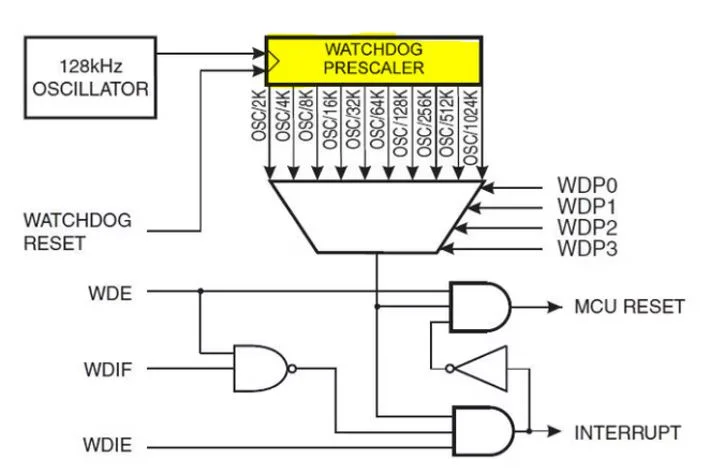

## [ArduinoWDT: Заготовки подключения Arduino watchdog ("сторожевой пёс")](https://habr.com/ru/articles/189744/)

Watchdog - это встроенный таймер на определенное время (до 8 сек в зависимости от чипа), который можно запустить программно. Как только таймер «дотикает» до нуля, контроллеру подается ***правильный сигнал сброса***  и всё устройство уходит в ***жесткую перезагрузку***. Самое главное, что этот таймер можно сбрасывать в начальное состояние также программным способом.

> Правильный сигнал сброса - достаточный по длительности для того, чтобы контроллер начал перегружаться. Иногда есть соблазн подключить к RST входу какой-либо цифровой выход Arduino и устанавливать его в 0 когда надо перегрузиться. Это плохой подход к решению проблемы, т.к. такого сигнала может быть недостаточно по времени, хотя и не исключено, что в некоторых случаях это тоже будет работать.

> Жесткая перезагрузка - это самая настоящая перезагрузка, которая происходит при нажатии на кнопку RESET. Дело в том, что есть еще понятие soft перезагрузки - это программный переход на 0-вой адрес. В принципе, это тоже полезная вещь, но с помощью нее невозможно перегрузить зависший контроллер Ethernet или взглюкнувший LCD.

Чтобы использовать функции Watchdog нужно подключить к проекту стандартную библиотеку:

```
#include <avr/wdt.h>
```

После подключения библиотеки доступны следующие три функции:

1. Запуск таймера watchdog:

```
wdt_enable(WDTO_8S);
/* Возможные значения для константы
  WDTO_15MS
  WDTO_30MS
  WDTO_60MS
  WDTO_120MS
  WDTO_250MS
  WDTO_500MS
  WDTO_1S
  WDTO_2S
  WDTO_4S
  WDTO_8S
*/
```
Таймер будет считать ровно столько, сколько указано в константе. По истечении этого времени произойдет перезагрузка.

2. Сброс таймера watchdog:

```
wdt_reset();
```

Думаю, понятно для чего нужна эта функция — пока вы вызываете ее, контроллер не сбросится. Как только система зависнет и эта функция вызываться перестанет, то по истечении заданного периода произойдет перезагрузка.

3. Отключение watchdog:

```
wdt_disable();
```

***Но!  Watchdog так работает только тогда, когда он прописан в загрузчике (в основном он работает только в Arduino Uno, а на Arduino Mega, Mini и Nano, как правило,  не работает).***

Дело в том, что после перезагрузки, которая была вызвана watchdog, контроллеры последних выпусков оставляют включенным watchdog на минимальный период, т.е. 15ms. Это нужно для того, чтобы программа как-то узнавала, что предыдущая перезагрузка была по watchdog. Поэтому первоочередная задача загрузчика (или вашей программы, если она запускается первой) — сохранить информацию о том, что перезагрузка была «неожиданной» и сразу же выключить watchdog. Если этого не сделать, то система уйдет в bootloop, т.е. будет вечно перегружаться.

Как известно, в Arduino есть специальный загрузчик, который выполняется в первую очередь после перезагрузки системы. И, к огромному сожалению, стандартный загрузчик не сбрасывает watchdog! Таким образом, система заходит в жестокий bootloop (состояние «crazy led», при котором светодиод на 13-м пине мигает как сумасшедший).

### Проверка работоспособности watchdog

Прежде чем что-то прошивать, нужно проверить - [вдруг ваша Arduino поддерживает watchdog](testwdt_Dremkin/testwdt_Dremkin.ino). 

```
#include <avr/wdt.h>

void setup()
{
  wdt_disable(); // бесполезная строка до которой не доходит выполнение при bootloop
  Serial.begin(9600);
  Serial.println("Setup..");
  
  Serial.println("Wait 5 sec..");
  delay(5000); // Задержка, чтобы было время перепрошить устройство в случае bootloop
  wdt_enable (WDTO_8S); // Для тестов не рекомендуется устанавливать значение менее 8 сек.
  Serial.println("Watchdog enabled.");
}

int timer = 0;

void loop()
{
  // Каждую секунду мигаем светодиодом и значение счетчика пишем в Serial
  if(!(millis()%1000))
  {
    timer++;
    Serial.println(timer);
    digitalWrite(13, digitalRead(13)==1?0:1); delay(1);
  }
  //  wdt_reset();
}
```

После перезагрузки (или подключения монитора к порту) встроенный светодиод мигнет, сигнализируя о том, что запустился загрузчик. Далее в секции setup происходит включение watchdog с таймером на 8 сек. После этого светодиод отсчитает нам это время и должна произойти перезагрузка.

Далее начинается самое интересное — если перезагрузка произошла и все повторяется в такой же последовательности, то вы имеете на руках Arduino, в которой загрузчик правильно обрабатывает watchdog. Если же после перезагрузки светодиод на 13-м пине начинает бесконечно мигать, то значит загрузчик не поддерживает watchdog. Здесь даже кнопка сброса не поможет. Для последующей прошивки нужно плату отключать от питания и после включения успеть прошить до первой перезагрузки.

### [Руководство по сторожевому таймеру Arduino с примерами](https://microcontrollerslab.com/arduino-watchdog-timer-tutorial/)



Управление сторожевым таймером осуществляется с помощью регистра WDTCSR. Все биты, кроме бита 7 (только для чтения), доступны для чтения и записи:

```
Бит	                7     6     5     4     3    2     1      0	
------------------------------------------------------------------
(0x60)	            WDIF  WDIE  WDP3  WDCE  WDE  WDP2  WDP11  WDP0
Чтение / Запись	    R     R/W   R/W   R/W   R/W  R/W   R/W    R/W	
Начальное значение  0     0     0     0     0    0     0      0
```

Установки битов WDP3, WDP2, WDP1 и WPD0 определяют период ожидания:

```
WDP3  WDP2  WDP1  WDP0   Цикл генератора  Тайм-аут
--------------------------------------------------
0     0     0     0        2K                16 мс
0     0     0     1        4K                32 мс
0     0     1     0        8K                64 мс
0     0     1     1       16K             0,125 с
0     1     0     0       32K              0,25 с
0     1     0     1	      64K               0,5 с
0     1     1     0      128K                 1 с 
0     1     1     1      256K                 2 c
1     0     0     0      512K                 4 c
1     0     0     1     1024K                 8 с 
```

Настройки сторожевого таймера

```
WDTON Fuse	WDE	WDIE	Mode	                  Действие
----------------------------------------------------------
1           0   0       Остановка                 НЕТ
1           0   1       Прерывание                Прерывание
1           1   0       Сброс системы             Сброс системы
1           1   1       Прерывание+Сброс системы  Прерывание->Сброс системы
0           x   x	    Сброс системы             Сброс системы
```

