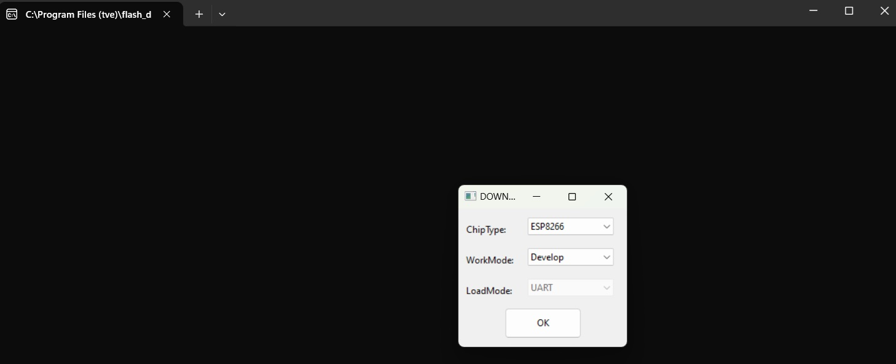

## Выгрузка HEX-кода из ESP32 и загрузка

### [ESP32 Flash Tool Upload](https://www.aeq-web.com/esp32-flash-tool-exported-program-upload-bin-hex-file/?lang=en)

### [Export compiled program (Arduino)](https://www.aeq-web.com/arduino-ide-export-compiled-esp32-bin-hex-program/?lang=en)

**Инструмент флэш-загрузки для ESP32**

С помощью инструмента загрузки ESP вы можете загружать скомпилированные программы (BIN-файлы) в ESP. Эта статья посвящена настройке инструмента и различным параметрам, которые необходимы для успешной загрузки программы. Всю информацию об экспорте программы из Arduino IDE можно найти в [этой статье](https://www.aeq-web.com/arduino-ide-export-compiled-esp32-bin-hex-program/?lang=en).

Ссылки по теме:

 [Arduino IDE: Export program as HEX/BIN file](https://www.aeq-web.com/arduino-ide-export-compiled-esp32-bin-hex-program/?lang=en)
 
 [ESP Flash Tool von ESPRESSIF](https://www.espressif.com/en/support/download/other-tools)
 
 ESPRESSIF предлагает программное обеспечение для загрузки скомпилированных программ на ESP32 или ESP8266. Программное обеспечение можно загрузить с веб-сайта производителя. После этого можно запустить EXE-программу ***flash_download_tool_3.9.7_2***, содержащуюся в распакованной папке:
 


В качестве "ChipType" следует выбрать "ESP32". В качестве "WorkMode" всегда следует выбирать "Develop - разработка". Существует также заводской режим, в котором производитель может программировать несколько контроллеров одновременно. После этого программное обеспечение можно запустить, нажав на кнопку "ОК". Откроется экран настроек перед записью в ESP32.

С подключенным USB-UART экран настроек выглядит следующим образом:


**Настройка параметров**

Перед выбором файла BIN и области памяти необходимо выбрать некоторые параметры для ESP32.

Совет: Вы также можете найти большинство параметров в Arduino IDE и использовать их оттуда.

В принципе, большинство плат ESP32 должны работать со следующими настройками:

```
СКОРОСТЬ SPI: 80 МГц
РЕЖИМ SPI: DIO
Размер флэш-памяти: 32 Мбит (4 Мбайт)
```

Дополнительно в программном обеспечении должен быть указан COM-порт. Скорость передачи установлена равной 921600 БОД.

После этого необходимо указать путь к файлу BIN и область памяти:


**Путь и область хранения**

Программа предлагает возможность загружать несколько файлов BIN одновременно. Таким образом, на ESP32 может быть загружена не только сама программа, но также загрузчик или разделы. Поскольку в принципе загрузчик всегда уже установлен на платах разработки перед поставкой, его не обязательно загружать. Достаточно загрузить только файл BIN с основной программой.

> ***Диапазон для основной программы всегда начинается с: 0X10000***

Как вы можете видеть на скриншоте, при правильном вводе оба поля станут зелеными.

При нажатии на "Start-Пуск" запускается процесс загрузки. Если это было успешно, это подтверждается кнопкой "FINISH-ГОТОВО". Как только на контроллере будет нажата кнопка сброса, загруженная программа должна запуститься.


 
 
 