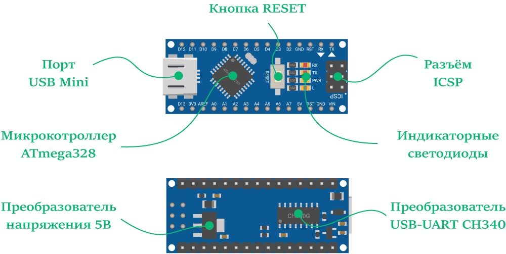
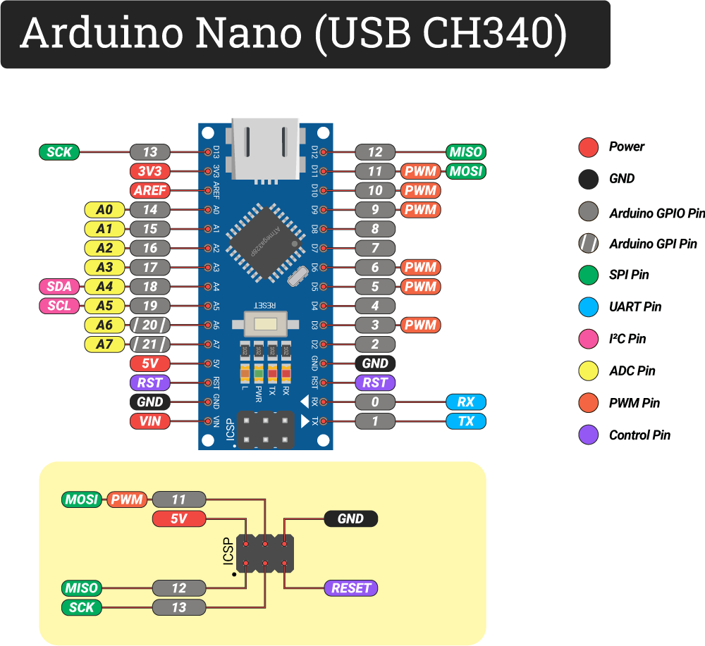
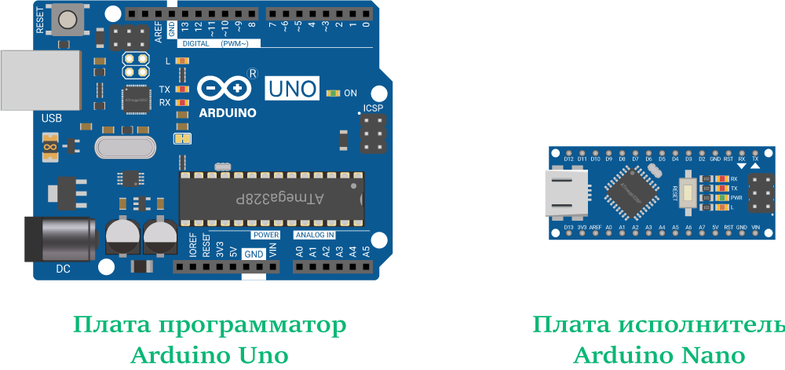

## KvizzySim: GPS-трекер на моей машине, v2

### Arduino Nano

#### [Arduino Nano: базовое руководство по использованию](https://wiki.iarduino.ru/page/arduino-nano/)

***Микроконтроллер Arduino Nano***  выполнен на микроконтроллере Microchip ATmega328 семейства AVR с тактовой частотой 16 МГц. 

Процессор обладает тремя видами памяти:

- 32 КБ Flash-памяти, из которых 0,5 КБ используются загрузчиком, который позволяет прошивать Arduino Nano с обычного компьютера через USB. Flash-память постоянна и её предназначение — хранение программ и сопутствующих статичных ресурсов.
- 2 КБ SRAM-памяти, которые предназначены для хранения временных данных, например переменных программы. По сути, это оперативная память платформы. SRAM-память энергозависимая, при выключении питания все данные сотрутся.
- 1 КБ энергонезависимой EEPROM-памяти для долговременного хранения данных, которые не стираются при выключении контроллера. По своему назначению — это аналог жёсткого диска для Arduino.

***Преобразователь напряжения 5 В*** - понижающий преобразователь AMS1117-5 с выходом 5 вольта, обеспечивает напряжением платформу Arduino Nano при питании через пин Vin. Диапазон входного напряжения — от 7 до 12 вольт, на выходе напряжение 5 В с максимальны током 1 А.

***Разъём ICSP*** - транслирует сигнальные пины интерфейса SPI. Линии ICSP-разъёма также продублированы на цифровых пинах 11, 12 и 13. Предназначен для загрузки прошивки в микроконтроллер ATmega328PB через внешний программатор для AVR. Одна из таких прошивок — Bootloader для Nano, который позволяет прошивать платформу по USB.

На плате Arduino Nano расположены два ряда по 15 контактов и 6 дублирующих контактов на разъёме ICSP для подключения питания, дополнительных модулей и сенсоров.

Всего физических контактов: 36 (15 + 15 + 6):

- Контакты ввода-вывода GPIO: 20
- Контакты ввода GPI: 2
- Контакты с ШИМ: 6 с разрядностью 8 бит
- Контакты с АЦП: 8 с разрядностью до 10 бит
- Аппаратные интерфейсы: 1× UART, 1× SPI, 1× I²C

***Характеристики***

- Модель: Arduino Nano
- Интерфейс USB-UART: CH340 / FT232R
- Микроконтроллер: ATmega328P / ATmega328PB
- Ядро: AVR
- Тактовая частота: 16 МГц
- Flash-память: 32 КБ
- SRAM-память: 2 КБ
- EEPROM-память: 1 КБ
- Входное напряжение питания: 5 В
- Через USB: 5 В
- Через пин Vin: 7–12 В
- Напряжение логических уровней: 5 В

#### [Запись загрузчика в Arduino Nano](https://wiki.iarduino.ru/page/arduino-bootloader-burn/#h3_5)

Загрузчик (от англ. bootloader) — это программа, которая позволяет загружать код в Arduino по USB без использования программатора. Однако, в некоторых случаях загрузчик может быть поврежден, например при некорректной прошивке или в результате аппаратного сбоя.

Восстановить, а точнее записать новый загрузчик в Arduino можно с помощью другой платы Arduino в роли программатора. Для удобства приведем нейминг плат:

Плата программатор — контроллер Arduino через который будем зашивать загрузчик в плату исполнитель. Для примера в роли программатора будем использовать Arduino Uno. Список поддерживаемых плат Arduino в роли программатора мы написали ниже.
Плата исполнитель — контроллер Arduino в который будем зашивать загрузчик. Предположим у вас слетел загрузчик на плате Arduino Nano.

#### [Запись времени и температуры на SD карту](zapis-vremeni-i-temperatury-na-sd-kartu/zapis-vremeni-i-temperatury-na-sd-kartu.md)

