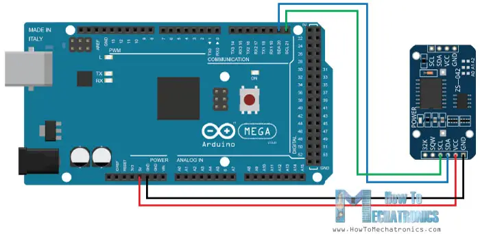
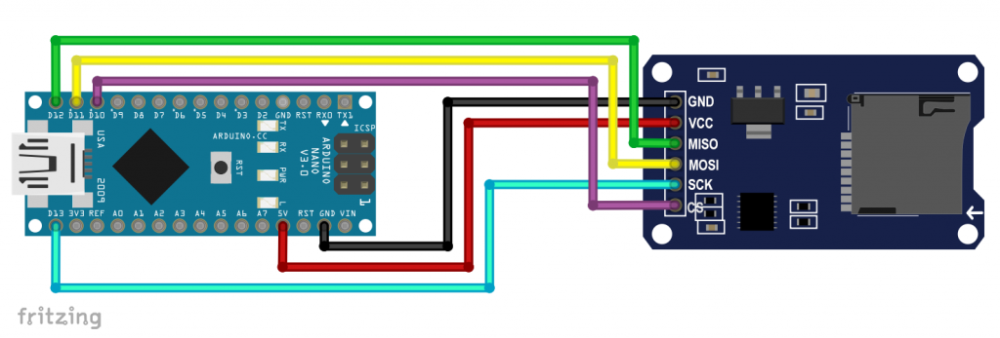

## Запись времени и температуры на SD карту

#### [Подключение модуля часов реального времени DS3231](https://microkontroller.ru/arduino-projects/podklyuchenie-modulya-chasov-realnogo-vremeni-ds3231-k-arduino/)

> ***В Ардуино Nano: SDA = A4, SCL = A5.***

#### [Запись данных на SD карту](https://microkontroller.ru/arduino-projects/zapis-dannyh-na-sd-kartu-s-pomoshhyu-arduino/)

#### [Библиотека: DS3231](http://www.rinkydinkelectronics.com/library.php?id=73)

Эта библиотека предназначена для простого сопряжения и использования RTC-модуля DS3231 с Arduino или chipKit. Библиотека также работает с RTC-модулем DS3232, но вы не сможете использовать внутреннюю оперативную память.

DS3231 — это недорогие и чрезвычайно точные часы реального времени I2C (Real Time Clock, RTC) со встроенным кварцевым резонатором с температурной компенсацией (TCXO) и кварцевым резонатором. Устройство оснащено входом для подключения батареи и поддерживает точное отображение времени при отключении основного питания. Интеграция кварцевого резонатора повышает долговременную точность устройства, а также сокращает количество деталей на производственной линии. DS3231 доступен в коммерческом и промышленном температурных диапазонах и поставляется в 16-контактном корпусе SO размером 300 мил.

RTC поддерживает отображение секунд, минут, часов, дня, даты, месяца и года. Дата в конце месяца автоматически корректируется для месяцев, в которых меньше 31 дня, с учетом високосных лет. Часы работают в 24-часовом или 12-часовом формате с индикатором AM/PM. Предусмотрены два программируемых будильника и программируемый выход прямоугольной формы. Адрес и данные передаются последовательно по двунаправленной шине I2C.

Прецизионный источник опорного напряжения с температурной компенсацией и схема компаратора отслеживают состояние VCC, чтобы обнаруживать сбои в подаче питания, обеспечивать выход сброса и при необходимости автоматически переключаться на резервный источник питания. Кроме того, контакт RST используется в качестве кнопочного входа для сброса микропроцессора.

Обратите внимание, что в этой библиотеке используется только 24-часовой формат времени и функция будильника не реализована.

> *ВАЖНО: Библиотека не тестировалась в сочетании с библиотекой Wire, и я понятия не имею, могут ли они использовать одни и те же контакты. Не задавайте мне об этом вопросов. Если у вас возникнут проблемы с совместным использованием контактов, вы можете подключить контакты SDA и SCL DS3231/DS3232 к любым свободным контактам на вашей плате для разработки. В этом случае библиотека будет использовать программный протокол, похожий на TWI-/I2C, для которого потребуется монопольный доступ к используемым контактам.*

Эта библиотека по умолчанию будет использовать быстрый режим ввода-вывода 2C (400 кГц) при использовании аппаратного интерфейса ввода-вывода 2C.

Я настоятельно рекомендую использовать DS3231 (или DS3232) вместо DS1307. Хотя DS3231/DS3232 может быть немного дороже DS1307, он гораздо точнее благодаря встроенному термокомпенсированному кварцевому резонатору (TCXO) и кварцевому резонатору. Это также означает, что вам не понадобится внешний кварцевый резонатор, как в случае с DS1307.

