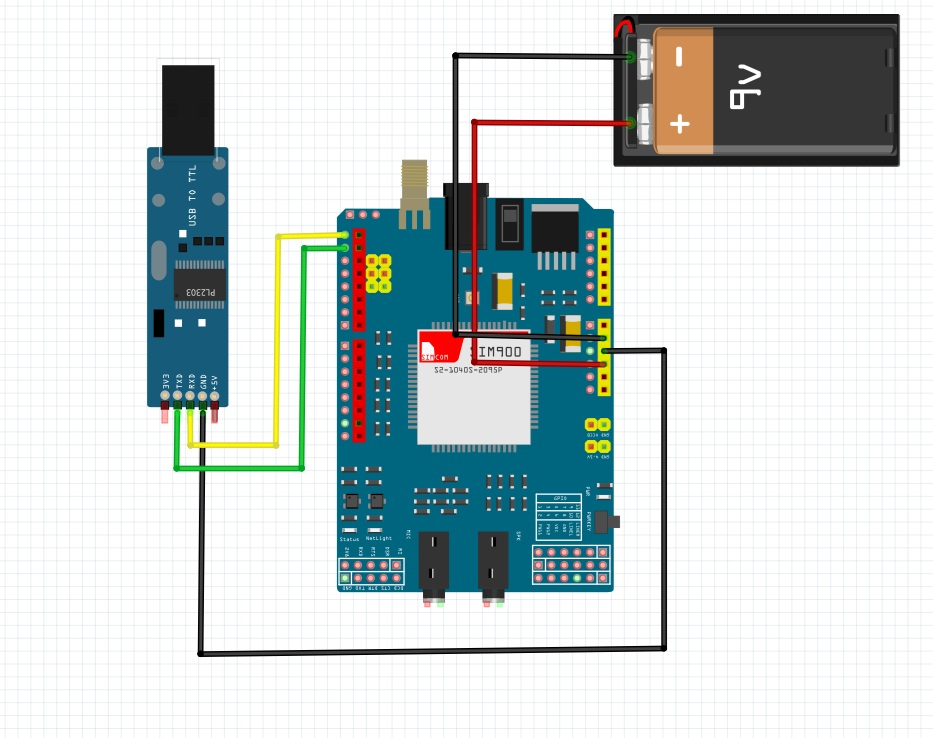
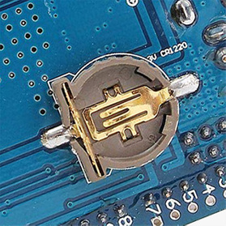
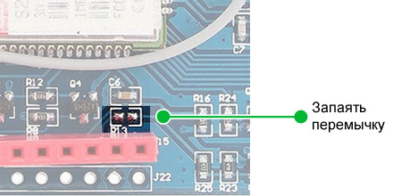
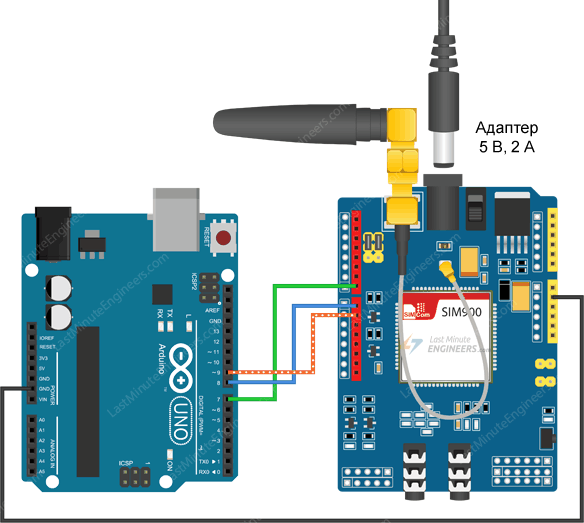

## KvizzyTrassa: Вывод графиков состояний Gps/Gprs и других контроллеров при движении по трассе.

После того, как обнаружилось (2026-04-19), что мой Kvizzy900 работает только в городе, а на дороге на дачу нет, возникло желание узнать что же происходит. Решил проанализировать в графиках на сайте (probatv.ru), снимая показания контроллеров по времени (затем буду пробовать по расстоянию).

---

#### Содержание

### [KvizzyTrassa/Trаssa - представление графиков](#kvizzytrassa-trassa---%D0%BF%D1%80%D0%B5%D0%B4%D1%81%D1%82%D0%B0%D0%B2%D0%BB%D0%B5%D0%BD%D0%B8%D0%B5-%D0%B3%D1%80%D0%B0%D1%84%D0%B8%D0%BA%D0%BE%D0%B2)

### [KvizzyTrassa/SD - снятие показаний и запись на SD-карту](#kvizzytrassa-sd---%D1%81%D0%BD%D1%8F%D1%82%D0%B8%D0%B5-%D0%BF%D0%BE%D0%BA%D0%B0%D0%B7%D0%B0%D0%BD%D0%B8%D0%B9-%D0%B8-%D0%B7%D0%B0%D0%BF%D0%B8%D1%81%D1%8C-%D0%BD%D0%B0-sd-%D0%BA%D0%B0%D1%80%D1%82%D1%83)

### [Памятка к часaм на SIM900](#%D0%BF%D0%B0%D0%BC%D1%8F%D1%82%D0%BA%D0%B0-%D0%BA-%D1%87%D0%B0%D1%81%D0%B0%D0%BC-%D0%BD%D0%B0-sim900)


---

### KvizzyTrassa-Trassa - представление графиков

#### [Graph-PHP Graph charts in PHP - Графики в PHP](https://github.com/vivesweb/graph-php)

#### [Красивые PHP-диаграммы для веб-приложений ](https://canvasjs.com/php-charts/)

#### [PHP Dynamic / Live Multi Series Chart](https://canvasjs.com/php-charts/dynamic-live-multi-series-chart/)

***Динамическая диаграмма PHP / многосерийная диаграмма в реальном времени***

Графики с несколькими рядами также поддерживают динамическое обновление данных. В приведенном примере показан динамический линейный график с несколькими рядами. Он также содержит исходный код на PHP, который можно запустить локально.

```
<?php

$dataPoints1 = array();
$dataPoints2 = array();
$updateInterval = 2000; //in millisecond
$initialNumberOfDataPoints = 100;
$x = time() * 1000 - $updateInterval * $initialNumberOfDataPoints;
$y1 = 1500;
$y2 = 1550;
// generates first set of dataPoints 
for($i = 0; $i < $initialNumberOfDataPoints; $i++){
	$y1 += round(rand(-2, 2));
	$y2 += round(rand(-2, 2));	
	array_push($dataPoints1, array("x" => $x, "y" => $y1));
	array_push($dataPoints2, array("x" => $x, "y" => $y2));
	$x += $updateInterval;
}

?>
<!DOCTYPE HTML>
<html>
<head>
<script>
window.onload = function() {

var updateInterval = <?php echo $updateInterval ?>;
var dataPoints1 = <?php echo json_encode($dataPoints1, JSON_NUMERIC_CHECK); ?>;
var dataPoints2 = <?php echo json_encode($dataPoints2, JSON_NUMERIC_CHECK); ?>;
var yValue1 = <?php echo $y1 ?>;
var yValue2 = <?php echo $y2 ?>;
var xValue = <?php echo $x ?>;

var chart = new CanvasJS.Chart("chartContainer", {
	zoomEnabled: true,
	title: {
		text: "Live Power Consumption of 2 Buildings"
	},
	axisX: {
		title: "chart updates every " + updateInterval / 1000 + " secs"
	},
	axisY:{
		suffix: " watts"
	}, 
	toolTip: {
		shared: true
	},
	legend: {
		cursor:"pointer",
		verticalAlign: "top",
		fontSize: 22,
		fontColor: "dimGrey",
		itemclick : toggleDataSeries
	},
	data: [{ 
			type: "line",
			name: "Building A",
			xValueType: "dateTime",
			yValueFormatString: "#,### watts",
			xValueFormatString: "hh:mm:ss TT",
			showInLegend: true,
			legendText: "{name} " + yValue1 + " watts",
			dataPoints: dataPoints1
		},
		{				
			type: "line",
			name: "Building B" ,
			xValueType: "dateTime",
			yValueFormatString: "#,### watts",
			showInLegend: true,
			legendText: "{name} " + yValue2 + " watts",
			dataPoints: dataPoints2
	}]
});

chart.render();
setInterval(function(){updateChart()}, updateInterval);

function toggleDataSeries(e) {
	if (typeof(e.dataSeries.visible) === "undefined" || e.dataSeries.visible) {
		e.dataSeries.visible = false;
	}
	else {
		e.dataSeries.visible = true;
	}
	chart.render();
}

function updateChart() {
	var deltaY1, deltaY2;
	xValue += updateInterval;
	// adding random value
	yValue1 += Math.round(2 + Math.random() *(-2-2));
	yValue2 += Math.round(2 + Math.random() *(-2-2));

	// pushing the new values
	dataPoints1.push({
		x: xValue,
		y: yValue1
	});
	dataPoints2.push({
		x: xValue,
		y: yValue2
	});

	// updating legend text with  updated with y Value 
	chart.options.data[0].legendText = "Building A " + yValue1 + " watts";
	chart.options.data[1].legendText = " Building B " + yValue2+ " watts"; 
	chart.render();
}

}
</script>
</head>
<body>
<div id="chartContainer" style="height: 370px; width: 100%;"></div>
<script src="https://cdn.canvasjs.com/canvasjs.min.js"></script>
</body>
</html>                              
```

###### [к содержанию](#%D1%81%D0%BE%D0%B4%D0%B5%D1%80%D0%B6%D0%B0%D0%BD%D0%B8%D0%B5)

### KvizzyTrassa-SD - снятие показаний и запись на SD-карту

#### Соединение с компьютером через PL2303 USB to TTL



**[2026-04-26:](#)**

- обновил драйвер на компьютере ***Prolific Usb-to-Serial Comm Port Версия: 3.4.25.218 [07.10.2011]***;

- подключил ***Terminal v1.9b***;

- проверил команды ***AT, AT+CPAS, AT+CSQ***.

###### [к содержанию](#%D1%81%D0%BE%D0%B4%D0%B5%D1%80%D0%B6%D0%B0%D0%BD%D0%B8%D0%B5)

### Памятка к часам на SIM900

***AT+CCLK*** - команда обращения к часам.

```
Test Command    Response
AT+CCLK=?       OK

Read Command    Response       ! If error is related to ME functionality:
AT+CCLK?        +CCLK: <time>  ! +CME ERROR: <err>
                OK             !
                               !
Write Command   Response       !
AT+CCLK=<time>  OK             !

```
Где параметр ***\<time\>*** имеет строковый тип (строка должна быть заключена в кавычки и вид, как ***"yy/MM/dd,hh:mm:ss±zz"***) формат - "гг/ММ/дд,чч:мм:сс±zz", где символы обозначают год (две последние цифры), месяц, день, час, минуты,
секунды и часовой пояс (указывает разницу, выраженную в четверти часа, между местным временем и GMT; диапазон -47...+48). Например, 6 мая 2010 года, 00:01:52 GMT+2 часа, равно "10/05/06,00:01:52+08 ".

[Я нашел этот код](https://stackoverflow.com/questions/30650732/how-can-i-read-date-and-time-data-from-rtc-of-sim900-module-using-arduino), и он у меня работает. Сначала вы запрашиваете время, а затем ожидаете ответа и анализируете его.

```
const char* const  SIM900::getTimeStamp()
{
  Serial2.print("AT+CCLK?");    // SIM900 AT command to get time stamp
  Serial2.print(13,BYTE);
  delay(2000);
  if (Serial2.available()>0)
  {
    int i = 0;
    while (Serial2.available()>0)
    {
      timeStamp[i]=(Serial2.read());
      i++;              
    }
  }
  int years  = (((timeStamp[25])-48)*10)+((timeStamp[26])-48);
  int months = (((timeStamp[22])-48)*10)+((timeStamp[23])-48);
  int days   = (((timeStamp[19])-48)*10)+((timeStamp[20])-48);
  int hours  = (((timeStamp[28])-48)*10)+((timeStamp[29])-48);
  int mins   = (((timeStamp[31])-48)*10)+((timeStamp[32])-48);
  int secs   = (((timeStamp[34])-48)*10)+((timeStamp[35])-48);
}
```

#### RTC (часы реального времени)

Плата расширения SIM900 GSM/GPRS Shield может быть настроена на сохранение времени. Таким образом, нет необходимости в отдельном RTC. Она сохранит время даже при выключенном питании.



Если вы хотите использовать внутренний RTC, вам необходимо установить батарею CR1220 на задней стороне платы.

Ваш оператор сети может не поддерживать установку времени автоматически. В этом случае вы можете сделать это вручную, используя AT команду AT+CCLK.

#### [Программный запуск](https://ampermarket.kz/shields/gsm-shield/)

Даже если вы включите плату расширения, вам нужно еще включить чип SIM900, чтобы он заработал.

В соответствии с техническим описанием, установив на выводе PWRKEY чипа низкий логический уровень (лог. 0) в течение как минимум 1 секунды, можно включить/выключить чип. 

Вместо того, чтобы каждый раз вручную нажимать PWRKEY, вы можете программно включать/выключать SIM900.

Во-первых, вам нужно запаять SMD перемычку, обозначенную как R13 на плате расширения, как показано на рисунке ниже.



Затем вам нужно подключить вывод D9 на плате расширения к выводу D9 на Arduino.




Наконец, вам нужно добавить следующую функцию в вашу программу.

```
void SIM900power()
{
	  pinMode(9, OUTPUT);
	  digitalWrite(9,LOW);
	  delay(1000);
	  digitalWrite(9,HIGH);
	  delay(2000);
	  digitalWrite(9,LOW);
	  delay(3000);
}
```
###### [к содержанию](#%D1%81%D0%BE%D0%B4%D0%B5%D1%80%D0%B6%D0%B0%D0%BD%D0%B8%D0%B5)


