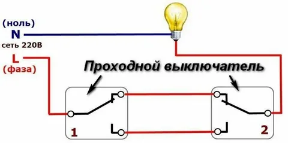

## IttvePW DDS - для дома, для семьи

Исследовательская и практическая (DDS - для дома, для семьи) работа с Arduino и другими платами. 

Сборка проектов оффлайн.

---

### [Живое радио и свет - AirRadioLight](#%D0%B6%D0%B8%D0%B2%D0%BE%D0%B5-%D1%80%D0%B0%D0%B4%D0%B8%D0%BE-%D0%B8-%D1%81%D0%B2%D0%B5%D1%82-airradiolight)



### [Выгрузка HEX-кoда из ESP32 и загрузка](#%D0%B2%D1%8B%D0%B3%D1%80%D1%83%D0%B7%D0%BA%D0%B0-hex-%D0%BA%D0%BE%D0%B4%D0%B0-%D0%B8%D0%B7-esp32-%D0%B8-%D0%B7%D0%B0%D0%B3%D1%80%D1%83%D0%B7%D0%BA%D0%B0)

### [U8g2-библиотека монохромной графики Arduino](U8g2/U8g2.md)

---

### [Живое радио и свет AirRadioLight](#)


###### [в начало](#ittvepw)

###### [к разделу](#esp32)

---

### [Выгрузка HEX кода из ESP32 и загрузка](vygruzka-hex-koda-iz-esp32-i-zagruzka/vygruzka-hex-koda-iz-esp32-i-zagruzka.md)


Для ESP32-CAM по умолчанию компиляция проектов идет при следующих настройках (при jоперативной памяти 2MB):

```
// Payment:                              "Al Thinker ESP32-CAM"
// CPU Frequency:                        "240MHz (WiFi/BT)"
// Flash Frequency:                      "80MHz"
// Flash Mode:                           "QIO"
// Partition Scheme:                     "Minimal SPIFFS (1.9MB APP with OTA/190KB SPIFFS)"
// Core Debug Level:                     "Ничего"
// Erase All Flash Before Sketch Upload: "Enabled"
// Port:                                 "COM5"

// Additional links for the Board Manager: https://raw.githubusercontent.com/espressif/arduino-esp32/gh-pages/package_esp32_index.json
// Менеджер плат:                          esp32 by Espressif Systems 3.0.3 installed
```

Если настройки должны быть изменены, то это указывается в комментариях к коду.

---


1

2

3

4

5

6

7

8

9

0


