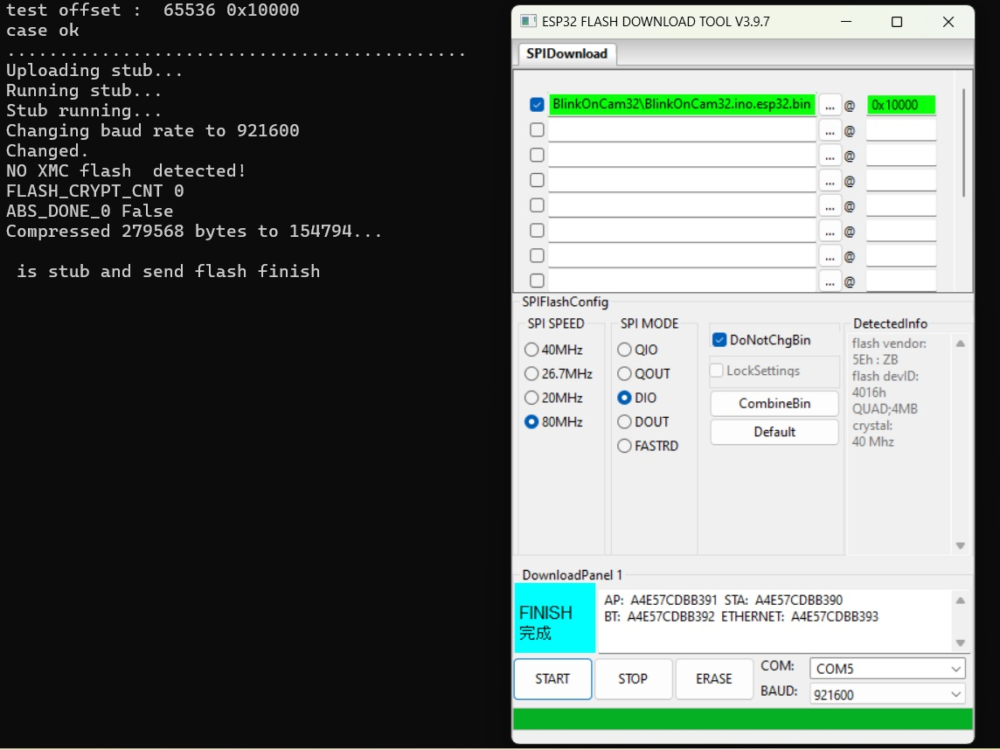
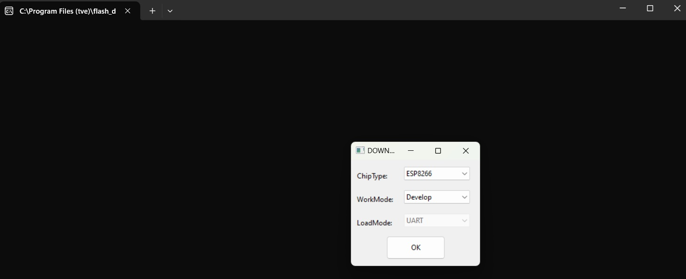
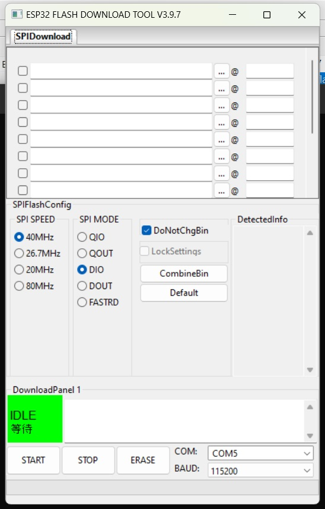
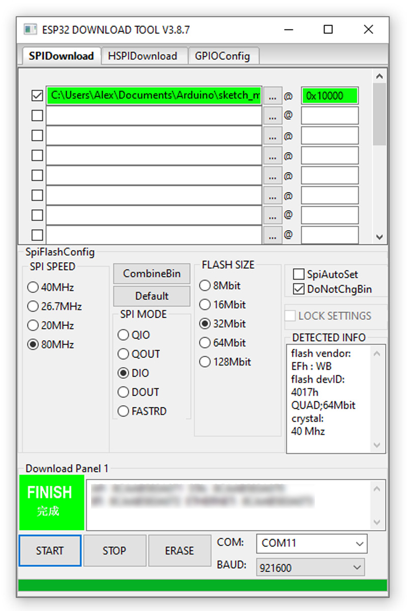
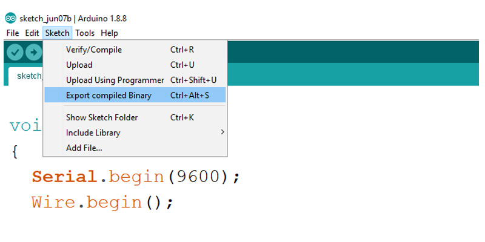
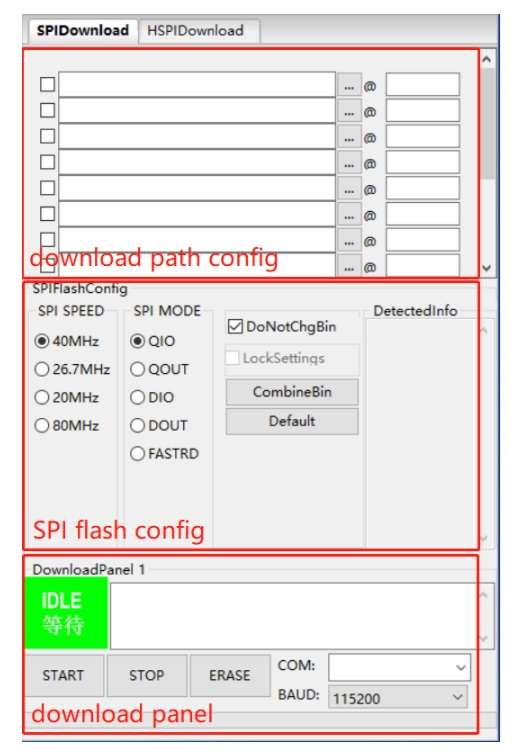
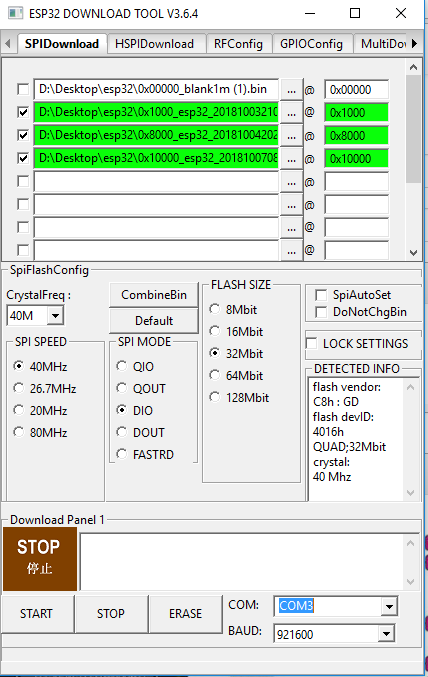

## Выгрузка HEX-кода из ESP32 и загрузка

---

### [Реальный пример](#)



2024-08-04 

Получилось удачно с первой загрузкой bin-файла для ESP32-CAM (как на jpg-файле, где представлены настройки и протокол загрузки):

- скомпилировал и выгрузил, как bin-файл, скетч BlinkOnCam32;
- запустил Flash Download Tоol  и настроил следующим образом:

```
SPI SPEED                                  80 МГц
SPI MODE                                   DIO
DoNotChgBin  поставил галочку
указал подключенный COM-порт
указал частоту                             921600
загрузил бинарный файл и указал адрес      0x10000
пометил этот файл галочкой (для загрузки)
```
- Gnd замкнул на IO0 на микросхеме
- нажал кнопку Reset
- запустил загрузку нажатием кнопки START

Произошла загрузка, вывод протокола загрузки, вывелась информация по плате в DetectedInfo.

---

### [ESP32 Flash Tоol Upload](#esp32-flash-tool-upload)

### [Expоrt compiled program (Arduino)](#export-compiled-program-arduino)

### "Как загрузить код в виде Hex-файла в esp32" - Яндекс-запрос

### [Flash Download Tоol User Guide](#flash-download-tool-user-guide)

### [Доп.информация для загрузки по Flash Download Tоol](#%D0%BF%D1%80%D0%BE%D1%88%D0%B8%D0%B2%D0%BA%D0%B0-%D1%87%D0%B5%D1%80%D0%B5%D0%B7-flash-download-tool)

---

### [ESP32 Flash Tool Upload](https://www.aeq-web.com/esp32-flash-tool-exported-program-upload-bin-hex-file/?lang=en)

**Инструмент флэш-загрузки для ESP32**

С помощью инструмента загрузки ESP вы можете загружать скомпилированные программы (BIN-файлы) в ESP. Эта статья посвящена настройке инструмента и различным параметрам, которые необходимы для успешной загрузки программы. Всю информацию об экспорте программы из Arduino IDE можно найти в [этой статье](https://www.aeq-web.com/arduino-ide-export-compiled-esp32-bin-hex-program/?lang=en).

Ссылки по теме:

[Arduino IDE: Export program as HEX/BIN file](https://www.aeq-web.com/arduino-ide-export-compiled-esp32-bin-hex-program/?lang=en)
 
[ESP Flash Tool von ESPRESSIF](https://www.espressif.com/en/support/download/other-tools)
 
 ESPRESSIF предлагает программное обеспечение для загрузки скомпилированных программ на ESP32 или ESP8266. Программное обеспечение можно загрузить с веб-сайта производителя. После этого можно запустить EXE-программу ***flash_download_tool_3.9.7_2***, содержащуюся в распакованной папке:
 


В качестве "ChipType" следует выбрать "ESP32". В качестве "WorkMode" всегда следует выбирать "Develop - разработка". Существует также заводской режим, в котором производитель может программировать несколько контроллеров одновременно. После этого программное обеспечение можно запустить, нажав на кнопку "ОК". Откроется экран настроек перед записью в ESP32.

С подключенным USB-UART экран настроек выглядит следующим образом:



**Настройка параметров**

Перед выбором файла BIN и области памяти необходимо выбрать некоторые параметры для ESP32.

Совет: Вы также можете найти большинство параметров в Arduino IDE и использовать их оттуда.

В принципе, большинство плат ESP32 должны работать со следующими настройками:

```
СКОРОСТЬ SPI: 80 МГц
РЕЖИМ SPI: DIO
Размер флэш-памяти: 32 Мбит (4 Мбайт)
```

Дополнительно в программном обеспечении должен быть указан COM-порт. Скорость передачи установлена равной 921600 БОД.

После этого необходимо указать путь к файлу BIN и область памяти:



**Путь и область хранения**

Программа предлагает возможность загружать несколько файлов BIN одновременно. Таким образом, на ESP32 может быть загружена не только сама программа, но также загрузчик или разделы. Поскольку в принципе загрузчик всегда уже установлен на платах разработки перед поставкой, его не обязательно загружать. Достаточно загрузить только файл BIN с основной программой.

> ***Диапазон для основной программы всегда начинается с: 0X10000***

Как вы можете видеть на скриншоте, при правильном вводе оба поля станут зелеными.

При нажатии на "Start-Пуск" запускается процесс загрузки. Если это было успешно, это подтверждается кнопкой "FINISH-ГОТОВО". Как только на контроллере будет нажата кнопка сброса, загруженная программа должна запуститься.

###### [в начало](#%D0%B2%D1%8B%D0%B3%D1%80%D1%83%D0%B7%D0%BA%D0%B0-hex-%D0%BA%D0%BE%D0%B4%D0%B0-%D0%B8%D0%B7-esp32-%D0%B8-%D0%B7%D0%B0%D0%B3%D1%80%D1%83%D0%B7%D0%BA%D0%B0)

---

### [Export compiled program-Arduino](https://www.aeq-web.com/arduino-ide-export-compiled-esp32-bin-hex-program/?lang=en)

**Экспорт скомпилированной программы (Arduino)**

Если программа загружается на микроконтроллер из Arduino IDE, ее необходимо сначала скомпилировать. Компилятор преобразует программу, написанную на C или C ++ в машинный язык. При этом создается либо шестнадцатеричный файл (.hex file), либо bin-файл (.bin file) в зависимости от вашего оборудования. Эта статья посвящена экспорту кодов в шестнадцатеричный файл или bin-файл из Arduino IDE.

Ссылки по теме:

[Upload an ESP32 compiled program (with Flash Tool)](https://www.aeq-web.com/esp32-flash-tool-exported-program-upload-bin-hex-file/?lang=en)

**Когда экспорт полезен?**

Файл hex и bin содержит готовую программу, включая все встроенные библиотеки.

Поэтому экспорт этого файла полезен, когда:

- программа должна быть заархивирована (резервная копия)
- программный код не должен быть изменяемым
- программный код не должен быть виден

Снова и снова случается, что библиотеки больше не обновляются разработчиками. Напротив, Arduino IDE и компилятор время от времени обновляются. Следствием этого является то, что могут возникать проблемы с компиляцией. 

Также может случиться так, что процесс компиляции прошел успешно, но программа или аппаратное обеспечение больше не работает из-за старой библиотеки. Это можно предотвратить с помощью экспорта программы, поскольку скомпилированная экспортируемая программа не зависит от версии Arduino IDE или библиотек.

Изменения в код нельзя вносить после процесса компиляции. Кроме того, исходный код больше не доступен для просмотра после компиляции. 

Существуют инструменты, позволяющие повторно декомпилировать уже скомпилированный файл. Однако на практике это работает лишь условно. Проще говоря, это означает, что вы можете получить приблизительный обзор скомпилированной программы, но прямая декомпиляция, изменение и перекомпиляция невозможны.

**Экспорт из Arduino IDE**

Между тем, экспорт программы с помощью Arduino IDE очень прост. 

В разделе ***[Эскиз] -> [Экспорт скомпилированного двоичного файла] ***программа будет скомпилирована, а затем будет создан файл. Для проектов для ESP создается файл BIN, проекты AVR сохраняются в виде файла .HEX. Файл сохраняется непосредственно в папку проекта параллельно с файлом .ino. 

На следующем скриншоте показана функция экспорта в Arduino IDE:



**Загрузка без Arduino IDE**

Для ESP32 есть собственный инструмент flash, который может загружать ранее экспортированный файл BIN. Это особенно выгодно, если программа предоставлена другим людям и нет необходимости устанавливать Arduino IDE. 

###### [в начало](#%D0%B2%D1%8B%D0%B3%D1%80%D1%83%D0%B7%D0%BA%D0%B0-hex-%D0%BA%D0%BE%D0%B4%D0%B0-%D0%B8%D0%B7-esp32-%D0%B8-%D0%B7%D0%B0%D0%B3%D1%80%D1%83%D0%B7%D0%BA%D0%B0)

---

### [Flash Download Tool User Guide](Flash_Download_Tool__en.pdf)

**Об этом руководстве**

В этом документе описывается, как загрузить и настроить встроенное ПО
для модулей Espressif с помощью инструмента загрузки Flash-файлов Espressif. Также приведены некоторые часто задаваемые вопросы и ответы. Этот документ применим к инструменту загрузки Flash версии 3.9.6.

**Уведомление об изменениях в документации**

Espressif предоставляет уведомления по электронной почте, чтобы клиенты были в курсе изменений в технической документации. Пожалуйста, подпишитесь на [https://www.espressif.com/en/subscribe](https://www.espressif.com/en/subscribe).

**Удостоверение (сертификация)**

Загрузите сертификаты на продукцию Espressif с
сайта [https://www.espressif.com/en/certificates](https://www.espressif.com/en/support/documents/certificates).

**2.1. Пользовательский интерфейс**

Откройте пакет Flash Download Tool, дважды щелкните по исполняемому файлу, чтобы перейти к основному интерфейсу инструмента:

- ***тип чипа:*** выберите тип чипа в зависимости от того, какой продукт вы используете.

- ***режим работы:*** режим работы инструмента. 

Ниже приведены различия между двумя режимами, поддерживаемыми в настоящее время – режимом разработки и заводским режимом:

• режим разработки использует абсолютный путь к микропрограмме и позволяет перепрошивать микропрограмму только на один чип за раз;

• заводской режим использует относительный путь. Рекомендуется устанавливать микропрограмму на flash в каталоге bin этого пакета инструментов. Он будет автоматически сохранен локально при закрытии после настройки.

При выборе заводского режима интерфейс будет заблокирован, что предотвратит
неправильную работу с мышью. Пожалуйста, нажмите кнопку LockSettings, чтобы включить редактирование.

- ***режим загрузки:*** интерфейс загрузки. В настоящее время ESP8266, ESP8285 и ESP32, ESP32-C2 поддерживают только UART, а другие типы микросхем поддерживают как UART, так и USB.

**2.2. Вкладка SPIDownload**

> ***SPI (Serial Peripheral Interface)*** - это синхронный последовательный интерфейс обмена данными между микроконтроллерами, микропроцессорами и периферийными устройствами.
> 
> Он позволяет передавать данные между устройствами по нескольким проводам, включая провод для синхронизации и по одному проводу на каждое направление передачи данных (один для отправки данных и один для приёма).



• ***Download Path Config*** - конфигурация пути загрузки

Вы можете настроить путь загрузки встроенного ПО и адрес загрузки (в
шестнадцатеричном формате), например, 0x1000.

• ***SPI Flash Config*** - конфигурация SPI Flash

> ***SPI SPEED***: скорость загрузки SPI.
> 
> ***SPI MODE***: режим загрузки SPI.
> 
> ***DETECTED INFO***: информация о микросхеме и кварцевом генераторе, которая обнаруживаются автоматически.
> 
> ***DoNotChgBin***: Если функция включена, то программа отображает исходное содержимое файла bin. Если функция не включена, программа обновляет встроенное ПО в соответствии со скоростью SPI и настройкой РЕЖИМА SPI в интерфейсе перед перепрошивкой.
> 
> ***CombineBin***: кнопка, которая объединяет все выбранные прошивки в пути загрузки Config в одну прошивку. 
Если включена функция DoNotChgBin, объединяет исходные прошивки. 
Если функция DoNotChgBin не включена, объединяет их в соответствии с настройками скорости SPI и режима SPI. Все неиспользуемые области между файлами прошивки будут заполнены значением 0xff. Объединенная прошивка будет сохранена, как ***./combine/target.bin***. Каждое нажатие этой кнопки приводит к перезаписи предыдущей прошивки.
> 
>***Default***: кнопка по умолчанию, восстанавливает настройки SPI до значений по умолчанию.
 
 • ***Download Panel*** - панель загрузки
 
> ***START***: начать загрузку
> 
> ***STOP***: остановить загрузку
> 
> ***ERASE***: стереть всю флэш-память
> 
> ***COM***: последовательный порт, используемый для загрузки
> 
> ***BAUD***: скорость передачи данных в бодах


**2.3.0 Общая информация и распиновка аппаратного SPI (HSPI) ESP8266**

ESP8266 оснащен двумя аппаратными модулями SPI. Espressif дал им названия SPI и HSPI.

SPI: Этот модуль SPI поддерживает четыре канала передачи данных и имеет 3 доступных вывода для выбора микросхемы. Однако он уже используется в 99,9% модулей, где рабочий код загружается с микросхемы флэш-ПЗУ. Невероятно сложно использовать это для других устройств одновременно без постоянных перерывов и это не рекомендую делать. Однако можно объединить выводы HSPI с теми же выводами, что и в модуле SPI. Модуль SPI возьмет на себя управление выводами, когда к нему потребуется доступ (но здесь не гарантируется постоянная работа HSPI). 

HSPI: Это означает Hardware SPI, но можно думать о нем как о пользовательском SPI. Необходимая распиновка приведена ниже.

```
Имя PIN-кода	GPIO #	Функция HSPI
------------------------------------
MTDI	        GPIO12	MISO (DIN)
MTCK	        GPIO13	MOSI (DOUT)
MTMS	        GPIO14	ЧАСЫ
MTDO	        GPIO15	CS / SS
```

Название Pin-кода указано в техническом описании. Обратите внимание, что MTCK (который является тактовым сигналом) НЕ является тактовым сигналом для HSPI! То же самое с выводом MTDO (data out). На самом деле это выбор микросхемы HSPI (или Slave Select). 

Примечание: GPIO15 необходимо привязать к GND при загрузке со встроенной флэш-памяти SPI (см. таблицу ниже). Просто используйте подходящий понижающий резистор (4,7 к или что-то вроде этого), чтобы вывод все еще мог нормально функционировать при выборе микросхемы. Не подключайте его напрямую к GND!

```
GPIO15	GPIO0	GPIO2	  Режим	  Описание
------------------------------------------------------
L	    L	    H	      UART	  Загрузить код с UART
L	    H	    H	      Flash	  Загрузка с SPI Flash
H	    x	    x	      SDIO	  Загрузка с SD-карты
```

Если шина HSPI правильно подключена к ведомому устройству SPI, то можно начать использовать код SDK. 

**2.3. Вкладка HSPIDownload**

Вкладка загрузки SPI необходима только для микросхем серии ESP8266, которые подключаются к внешней флэш-памяти через SPI. Она имеет тот же интерфейс, что и вкладка HSPIDownload.

***2.4. Вкладка множественной загрузки Factory***.

• В режиме Factory используется относительный путь. По умолчанию программа загружает прошивку из папки bin в каталоге tool. ***В то время как в режиме разработки используется абсолютный путь.*** Преимущество заводского режима заключается в том, что до тех пор, пока прошивка для прошивки остается в папке bin каталога инструментов, при копировании пакета инструментов на другие заводские компьютеры проблем с доступом не возникнет.

ets ...


 
###### [в начало](#%D0%B2%D1%8B%D0%B3%D1%80%D1%83%D0%B7%D0%BA%D0%B0-hex-%D0%BA%D0%BE%D0%B4%D0%B0-%D0%B8%D0%B7-esp32-%D0%B8-%D0%B7%D0%B0%D0%B3%D1%80%D1%83%D0%B7%D0%BA%D0%B0)

---

### [Прошивка через Flash download tool](https://wifi-iot.com/p/wiki/169/ru/)

> ***Настройка DoNotChgBIn должна быть выключена.***

> Перед первой прошивкой в некоторых случаях, когда модуль не стартует из-за мусора в памяти требуется прошить пустой файл. Или воспользоваться опцией ERASE в настройках Flash tools.



Одним файлом - можно скачать и прошить только один этот файл по адресу 0x0000.

Или прошить 3 файла по указанным адресам:

0x1000 - загрузчик прошивки (bootloader), адрес для ESP32, ESP32S2. Для ESP32C3 и ESP32S3 - 0x0000 адрес;

0x8000 - таблица разметки разделов. Определяет размер секций и наличие SPIFFS  диска;

0x10000 - сама прошивка. Только этот файл изменяется при компиляции новой прошивки.

> Обратите внимание на размер flash памяти, обычно в модулях установлена память на 4 или 16 мегабайт. В прошивающей программе необходимо указать этот размер в мегабитах! Установленный размер памяти в мегабитах видно в программе Flash download tools в окне Detected info.
 
**Важно! Если в модуле 4 мегабайта памяти, то  при прошивке через программатор файл прошивки (адрес 0x10000) должен быть не больше 1.6 мегабайта !**

> ***Необходимо указать режим работы flash памяти DIO***. В режиме QIO модули не работают, bootloader собран в режиме DIO.
 
> Для загрузки прошивки необходимо GPIO 0 подтянуть к GND и нажать reset.

Готовые платы с USB-UART обычно автоматически запускаются в режиме прошивки, но иногда при проблемах требуется так же замыкать GPIO 0. Иногда для этого отдельно выведена кнопка BOOT.

**Особенности прошивки ESP32S2 min** - три варианта прошивки:

```
1. Прошить через  flash_download_tool_3.9.3 - она поддерживает ESP32S2. При подключении через USB нужно выключить no-stub установив в конфиге no-stub = True 

2. Через USB используя прошивку dfu_esp32s2.bin . Требуется установка драйвера через программу https://zadig.akeo.ie/ . Прошить через онлайн прошиватор https://dfu.stetelthings.com/. 

3. UART0 не выведен . Шьем через UART1(GPIO17-U1TXD, GPIO18-U1RXD ) через внешний USB-UART. Прошивка через esptools требуется ключ --no-stub.
```

В обоих случая для запуска режима прошивки требуется зажать кнопку "0" сбросив чип по питанию или нажав кнопку RST.

ets ...

###### [в начало](#%D0%B2%D1%8B%D0%B3%D1%80%D1%83%D0%B7%D0%BA%D0%B0-hex-%D0%BA%D0%BE%D0%B4%D0%B0-%D0%B8%D0%B7-esp32-%D0%B8-%D0%B7%D0%B0%D0%B3%D1%80%D1%83%D0%B7%D0%BA%D0%B0)

---
 